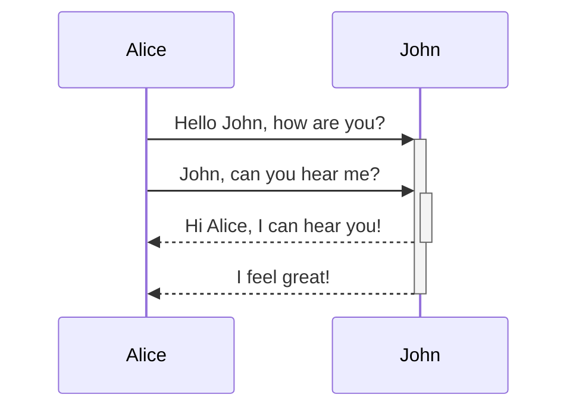
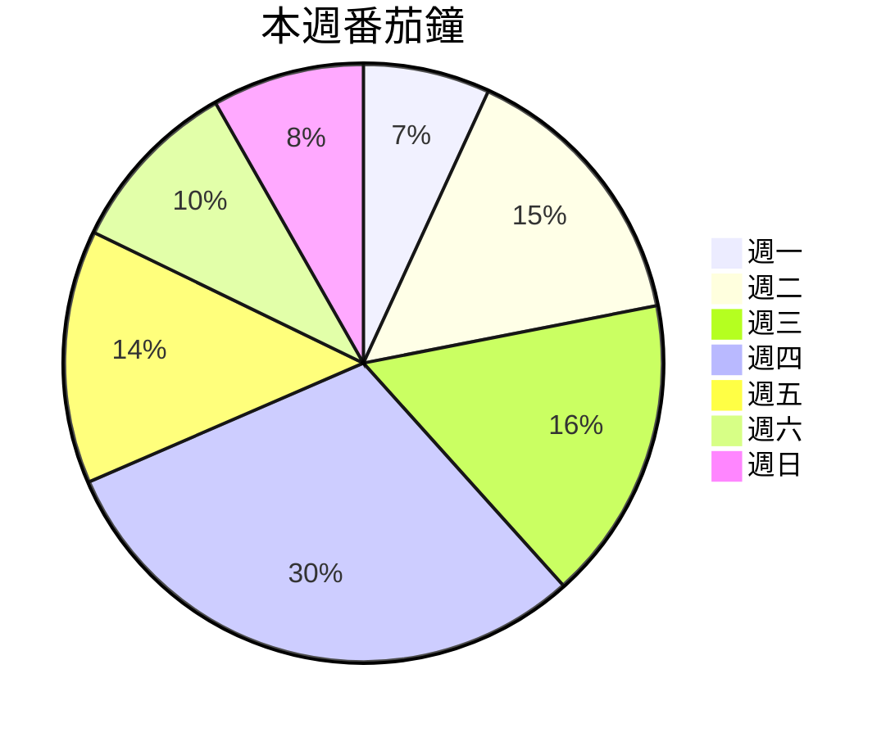

# [Obs＃82] 用Obsidian學會Markdown--Markdown完整解析


## 1. Markdown是什麼？
1. Markdown是一個輕量級的標記語言，相較於複雜、繁多的HTML，Markdown更簡單、更容易使用
2. 將純文字內容賦予格式化的標記，能讓文字轉換成HTML
3. Markdown提供了易讀易寫的標記格式
4. [[John Gruber]]在2004年發明
5. 隨著科技的進步，Markdown也衍生了多個版本

## 2. 為什麼要學Markdown?
* Markdown應用範圍廣泛：舉凡網站、簡報、筆記、文件、書籍、電子郵件、即時通訊軟體都在使用。
* Markdown可攜性高
* Markdown具有平台獨立性

### 2.1. 幾個Markdown的應用
太多了，族繁不及備載，列舉一二。

- 線上Markdown編輯器：[StackEdit](https://stackedit.io)、[HackMD](https://hackmd.io)
- 靜態網站產生器(Static Site Generator)：[Hugo](https://github.com/gohugoio/hugo)、[MkDocs](https://www.mkdocs.org/)、[VuePress](https://vuepress.vuejs.org/)
- 瀏覽器擴充：
	- Email格式轉換：[Markdown Here](https://markdown-here.com/)
	- 網站下載成Markdown：[MarkDownload](https://chrome.google.com/webstore/detail/markdownload-markdown-web/pcmpcfapbekmbjjkdalcgopdkipoggdi)
- Windows Markdown編輯器：[Markdown Monster](https://markdownmonster.west-wind.com/)、[ghostwriter](https://wereturtle.github.io/ghostwriter/)
- macOS Markdown編輯器：[iA Writer](https://ia.net/zh-hant/writer)、[MacDown](https://macdown.uranusjr.com/)、[Bear](https://bear.app/)、[Craft](https://www.craft.do/)、[Drafts](https://getdrafts.com/)
- Linux Markdown編輯器：[ghostwriter](https://wereturtle.github.io/ghostwriter/)、[ReText](https://github.com/retext-project/retext)
- 跨平台 Markdown編輯器：[Typora](https://typora.io/)
- iOS / Android Markdown編輯器：[iA Writer](https://ia.net/zh-hant/writer)、[Drafts](https://getdrafts.com/)

## 3. Markdown的處理步驟
![[Markdown Processing|700]]

## 4. 涵蓋的標記
### 4.1. 區塊標記

| 標記符號 | 用途 |
|:-----|:---|
| #    | 標題 |
| `> `   | 引言   |
| `1. `   | 有序列表   |
| `* `   | 無序列表   |
| `- [ ] `   | 任務(待辦事項)   |
|  ` ``` `  | 程式碼區塊   |
|  ---   | 水平分隔線   |
|  --\|--   | 表格   |

### 4.2. 行內標記

|   標記符號                                                 |   用途      |
|:-------------------------------------------------------|:----------|
|   `*`                                                  |   斜體      |
|   `**`                                                 |   粗體      |
|   `***`                                                |   粗斜體     |
|   `~~`                                                 |   刪除線     |
|   &#61;&#61;                                           |   高亮      |
| `<sup>`                                          |   上標      |
| `<sub>`                                          |   下標      |
|  `code`                                                |  行內程式碼    |
|  `[]()`                                                |  網址鏈接     |
|  `[[]]`                                                |  內部鏈接     |
|  ``                                               |  圖片       |
|  `![[]]`                                               |  嵌入檔案     |

## 5. 標題 (Heading)

| Heading           |  HTML                                |
|:------------------|:-------------------------------------|
| # Heading Level 1 | `<h1>Heading Level 1</h1>` |
| ## Heading Level 2 | `<h2>Heading Level 2</h2>` |
| ### Heading Level 3 | `<h3>Heading Level 3</h3>` |
| #### Heading Level 4 | `<h4>Heading Level 4</h4>` |
| ##### Heading Level 5 | `<h5>Heading Level 5</h5>` |
| ###### Heading Level 6 | `<h6>Heading Level 6</h6>` |

> [!TIP] 技巧💡
> 1. 井號後至少加一個空白
> 2. 井號緊接標題會變成標籤
> 3. 記憶方法：帶頭大哥、二哥、三哥... 六弟，井號越多的等級越小
> #### 我的用法
> 1. `# `: 檔名(筆記名稱)
> 2. `## `: 大標題(章)
> 3. `###`：次級標題(節)

> [!OBS]
> 井號後緊接英數字會形成標籤：`#標籤`

### 5.1. 另類標題

|  Heading                            |   HTML                                 |
|:------------------------------------|:---------------------------------------|
|  Heading Level 1<br>=============   |  `<h1>Heading Level 1</h1>`            |
| Heading Level 2<br>---------------  |  `<h2>Heading Level 2</h2>`            |

### 5.2. 段落 (Paragraph)
段落間以一個空行隔開。

> [!INFO]+ 資訊
> Obsidian設定→【編輯器】→【精確的換行符號】：勾選後設定成Markdown的嚴格換行
> * 連續兩行間插入一行，才會變成兩行，否則會連接在一起
> * 第一行最末插入兩個空白會變成兩行
>


> [!comment] 對於段落的建議
> 1. 不要勾選【精確的換行符號】
> 2. 段落開頭不要加空白

## 6. 換行 (Line break)
【精確的換行符號】設定會影響換行的行為。

> [!comment]+ 對於換行的建議
> 1. 不要勾選【精確的換行符號】
> 2. 不要用行末兩個空白的方法換行
> 3. 特殊情況下用HTML的`<br>`插入換行(例如在表格的儲存格裡要換行)

## 7. 文字變化 (Emphasis)
### 7.1. 斜體
被前後一個星號(`*`)、一個底線(`_`)或 `$` (非Markdown)：夾住的文字會變成斜體。

| Italic text           |  HTML                                | |
|:------------------|:-------------------------------------|--|
| `話說天下大勢，*分久必合*` | `話說天下大勢，<em>分久必合</em>` | 話說天下大勢，*分久必合*|
| `，_合久必分_` | `，<em>合久必分</em>` | ，_合久必分_|
| `$數學符號使用$` | `<mjx-math class="MJX-TEX" aria-hidden="true">...` | $數學符號使用$`|

> [!comment] 對於斜體的建議
> 盡量使用`*`

### 7.2. 粗體
被前後兩個星號(`**`)或兩個底線(`__`)夾住的文字會變成粗體。

| Bold text           |  HTML                                |顯示|
|:------------------|:-------------------------------------|--|
| `話說天下大勢，**分久必合**` | `話說天下大勢，<strong>分久必合</strong>` |話說天下大勢，**分久必合**|
| `，__合久必分__` | `，<strong>合久必分</strong>` | ，__合久必分__ |

> [!comment] 對於粗體的建議
> 盡量使用`**`

### 7.3. 粗斜體
被前後三個星號(`***`)或三個底線(`___`)夾住的文字會變成斜體。`__*`兩個底線一個星號或`**_`兩個星號一個減號等的組合也可以用，不過不建議使用。

| Italic text           |  HTML                                | |
|:------------------|:-------------------------------------|--|
| `話說天下大勢，***分久必合***` | `話說天下大勢，<strog><em>分久必合</em></strog>` | 話說天下大勢，***分久必合***|
| `，___合久必分___` | `，<strong><em>合久必分</em></strong>` | ，___合久必分___|

> [!comment] 對於斜體的建議
> 盡量使用`***`

### 7.4. 刪除文字
被前後兩個波浪號(`~~`)夾住的文字會變成刪除樣式。

> [!EXAMPLE] 範例
> 被前後兩個波浪號(`~~`)夾住的文字會變成~~刪除樣式~~。

### 7.5. 高亮文字
被前後兩個等號(&#61;&#61;)夾住的文字會變成重要強調樣式。

> [!EXAMPLE] 範例
> 學習Obsidian的最好方法是==開始寫==、 ==認真寫==，主題和外掛只是輔助。

> [!WARNING] 注意❗
> Dataview的行內表示式使用「\`= 運算式 \`」 的格式，倒引號再兩個等號會造成Dataview解析錯誤，因此使用`&#61;`。

### 7.6. 下底線
非Markdown：Markdown沒有底線格式，可以使用HTML的`<u>`與`</u>`來形成文字底線。

> [!EXAMPLE] 範例
> 不要在Obsidian的外掛上花太多精力，<u>筆記本身</u>才是最重要的。

### 7.7. 上頂線
非Markdown：使用HTML的`<ruby>`等標籤。

> [!EXAMPLE] 範例
> <ruby style="ruby-position: under">漢字<rt>ㄏㄢˋ ㄗˋ</rt></ruby>
>
> <ruby style="ruby-position:under">電腦<rt>dian nao</ruby>
><span style="-webkit-text-emphasis: filled red">重要內容！</span> <span style="border-top: 1px solid red">重要內容！</span>

### 7.8. 上標字與下標字
非Markdown：Obsidian沒有直接支援上標字與下標字的語法，有兩個方法解決。

#### 7.8.1. 方法1. MathJax
用[MathJax](http://docs.mathjax.org/en/latest/basic/mathjax.html) (JavaScript display engine for LaTeX, MathML, and AsciiMath notation)語法達成。

> [!TIP] 語法
>  `$文字^上標字$`
>  `$文字_下標字$`

> [!WARNING] 注意
> 會變成斜體

* $E=MC^2$
* $CO_2$

#### 7.8.2. 方法2. 用HTML標籤
> [!TIP] 語法
>  `文字<sup>上標字</sup>`
>  `文字<sub>下標字</sub>`

* E=MC<sup>2</sup>
* CO<sub>2</sub>

### 7.9. 行內程式碼
`行內程式碼`(用一個倒引號夾住文字)也可以變化文字的顯示，有需要時也可使用。

## 8. 區塊引言 (Blockquotes)
1. 以「> 」(小於再加一個空白)在每行開頭以形成區塊引言。
2. 以「>> 」(兩個小於再加一個空白)在每行開頭以形成第二階層的區塊引言。
3. 區塊裡能再使用部份Markdown標記，具體能使用的標記因應用系統的實作而有不同。

> 111
>> 222 **粗體**
>>> AAA *斜體*
>>> BBB ***粗斜體***
>> 333
> 444

> [!comment] 對於區塊引言的建議
> 1. 區塊前後最好插入一行空行
> 2. 可以用Obsidian的Callouts擴充取代

> [!OBS]
> ### Callouts重點提示語法
> `> [!Type] Title`
> `> 內容`

## 9. 列表 (Lists)
### 9.1. 有序列表
1. 以「數字. 」(數字、點、空白)或「數字) 」開頭
2. 數字不必照順序排列
3. 起始數字以列表第一個項目的數字開始遞增
4. 列表項目間有空行時，每個項目會自動插入空行。空行後有非列表內容時，第二個區塊會以開始項目的數字重新編號
5. 自動重新編號：按<span class="keybs">Tab</span>再按<span class="keybs">Shift+Tab</span>
6. 開頭四個空白或<span class="keybs">Tab</span>形成第二階層列表

> [!comment] 對於有序列表的建議
> 盡量使用`數字. `格式

### 9.2. 無序列表
1. 以「星號 」(`*`、空白)、「減號 」或「加號 」開頭
2. 列表項目間有空行時，每個項目會自動插入空行
3. 開頭四個空白或<span class="keybs">Tab</span>形成第二階層列表
4. 項目裡有「數字. 」(數字、點、空白)造成顯示異常，可以在點的左側加上跳脫字元反斜線

> [!comment] 對於無序列表的建議
> 固定使用同一種符號，盡量使用`*`

## 10. 程式碼 (Code)
### 10.1. 行內程式碼
1. 用一個倒`引號夾`住程式碼
2. 用兩個倒引號以顯示行內程式碼

### 10.2. 程式碼區塊
1. 用三個倒引號開頭，結尾行用三個倒引號開頭
2. 三個倒引號也可用波浪號（`~~~`）
3. 程式碼每行用至少四個空白或<span class="keybs">Tab</span>開頭

> [!TIP] 技巧💡
> 要顯示程式碼區塊完整內容：最外面用4個倒引號夾住
> ````
> ```
> <kbd>Ctrl+Enter</kbd>
> ```
> ````


### 10.3. 擴充語法
開頭倒引號後可指定程式碼使用語言。

````html
```html
<kbd>Ctrl+Enter</kbd>
```
````

## 11. 水平分隔線
三個以上的星號、減號或底線。

---

> [!comment] 對於水平分隔線的建議
> 分隔線上下最好用插入一個空行

## 12. 網址鏈接
提示文字可省略。

> [!TIP] 語法
>  `[顯示文字](網址鏈接 "提示文字")`
>  `<網址鏈接>`
>  `<Email@your_Email_Address>`
>  ---
>  `[顯示文字][引用代碼]`
>
> `[引用代碼]: 網址鏈接`

> [!INFO] 💡 小技巧 如何記憶？
> 成語「內方外圓」→「前方後圓」

> [!comment] 對於鏈接的建議
> 網址裡如果有空白時：
> 1. 把空白改成「%20」
> 2. 網址改成`<鏈接網址>`
> 3. Obsidian在還到http://、https://開頭的網址文字時，會自動變成網址超鏈接

> [!OBS] Obsidian內部鏈接
> `[[本地筆記路徑]]`
> `[[本地筆記路徑|特定的顯示文字]]`
> `[[本地筆記路徑#標題]]`
> `[[本地筆記路徑^區塊代碼]]`
>

## 13. 圖片

> [!TIP] 語法
>  ``
>  ``
>  ``
>  ``
>  `![顯示文字][引用代碼]`
>
> `[引用代碼]: 網址鏈接`

> [!obs]
> `![[本地圖片路徑]]`
> `![[本地圖片路徑|顯示寬度]]`
> `![[本地圖片路徑|顯示寬度x高度]]`
>
> #### 嵌入內部鏈接
> `![[內部鏈接]]`
> `![[內部鏈接|特定顯示文字]]`
> `![[內部鏈接#標題]]`
> `![[內部鏈接^區塊代碼]]`

> [!comment] 圖片鏈接
> `[](鏈接網址)`

[](http://jdev.tw)

## 14. 表格
### 14.1. 有對齊功能的表格
| 標題1 | 標題2 | 標題3 |
|:----|:---:|----:|
| 111 | 222 | 333 |
| 444 | 555 | 666 |

### 14.2. 簡單表格

```
標題1 | 標題2 | 標題3
--|--|--
111 | 222 | 333
444 | 555 | 666
```

> [!TIP] 技巧
>  儲存格裡的換行：用`<br>`
>  儲存格裡有用到Pipe(|)時：`\|`

## 15. 區塊代碼
段落下方插入境`^區塊代碼`讓內部鏈接參考使用。

## 16. 註腳
1. `[^數字或註腳代碼]`：指定註腳，自動以數字顯示
2. `[^數字或註解代碼]: 說明文字`：註腳說明

Markdown標記語言[^語言]由 John Grube發明。

[^語言]: 註腳說明

## 17. 任務
輸入任務描述後按一個 <span class="keybs">Ctrl+Enter</span>即可快速形成任務語法。開頭字元可用減號、加號與星號。

> [!TIP] 語法
>  `- [ ] 未完成任務描述`
>  `- [x] 已完成任務描述`

## 18. 註解
不顯示在HTML裡的內容即為註解。
> [!TIP] 語法
>  以`<!--`開頭，`-->`結尾
>  以`%%`夾位的內容即為不顯示的註解

## 19. 嵌入網頁
`<iframe src="網址"></iframe>`

## 20. 第三方整合
### 20.1. Mermaid: 流程圖等
核心支援。

* [Online FlowChart & Diagrams Editor - Mermaid Live Editor](https://mermaid-js.github.io/mermaid-live-editor/edit#pako:eNpVkE1qw0AMha8itEohvoAXhcZOsgmk0Ow8WQiPnBmS-WEsU4Ltu3ccU2i1kt77nhAasQ2ascRbomjgUisPuT6ayiTbi6P-CkXxPh1ZwAXPzwl2m2OA3oQYrb-9rfxugaAaTwvGIMb6-7xa1St_9jxB3ZwoSojXv87lO0ywb-ynyev_OyZxTh2ajsqOipYSVJReCG7RcXJkdT59XBSFYtixwjK3mjsaHqJQ-TmjQ9QkvNdWQsJS0sBbpEHC19O3v_PK1JbyI9wqzj8k-lxH)

````

````


````

````


### 20.2. Excalidraw
### 20.3. Diagrams
### 20.4. Emoji

## 21. YAML Front matter
預設關鍵字：

### 21.1. tags
- 不能用空白
- 可以用底線(`_`)或減號(`-`)當做分隔字元
- 不能全為數字：`#3c`可以用，但`#2022`無法使用
- 能用正斜線(`/`)形成巢狀式標籤：`3c/notebook`

> [!TIP] 技巧💡
>  tags寫法很有彈性，以下皆可使用：
> ```
> tags: test1, test2, tet3/test3-1
> tags: [ test1, test2, tet3/test3-1 ]
> tags: 
>   - test1 test2 tet3/test3-1 
>  
> tags: 
>   - test1
>   - test2
>   - tet3/test3-1 
> ```

### 21.2. aliases
筆記檔名的別名，讓一篇筆記有多個名稱。

```
---
aliases: [Markdown用法, Markdown語法彙總]
---
```

### 21.3. cssClasses
cssClass或cssClasses皆可使用。讓本篇筆記套用特定的CSS類別。

### 21.4. publish
`publish: true`發佈到Publish網站，`publish: false`不發佈到Publish網站。

## 22. 相關鏈接
* [Markdown 語法說明](https://markdown.tw/)
* [教程-MarkDown](http://markdown.cn/)
* [Format your notes - Obsidian Help](https://help.obsidian.md/How+to/Format+your+notes)

%%

## 23. 教學影片
<iframe width="650" height="315" src="https://www.youtube.com/embed/lnsQsFCYhNc" frameborder="0" allow="accelerometer; autoplay; encrypted-media; gyroscope; picture-in-picture" allowfullscreen></iframe>
%%

＃＃
